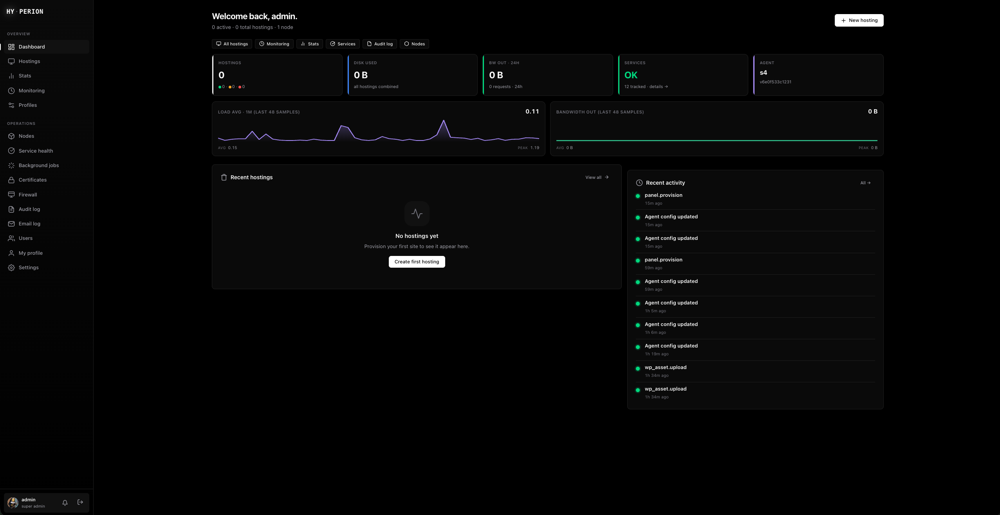
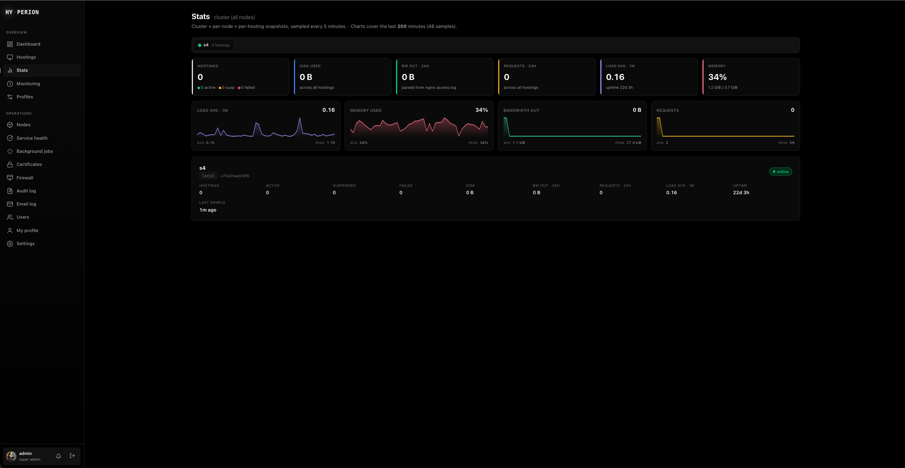

<div align="center">

# 🦅 Hyperion

**Self-hosted, multi-node hosting control panel written in Rust.**

One binary on each server, one web UI on the master.
Provisions PHP / static / Node.js sites end-to-end —
nginx + FPM pool + database + TLS + WordPress — in a single atomic
transaction. Manages a fleet of VPSes from one screen,
and **imports your existing sites from HestiaCP or CloudPanel**.

[](https://www.rust-lang.org/)
[](#license)
[](#install)
[](#testing)
[](#project-status)

[**Install**](#install) · [**Features**](#features) ·
[**Migrate in**](#migrate-in-panel-import) · [**Multi-node**](#multi-node-cluster) ·
[**Architecture**](#architecture) · [**Status**](#project-status)

</div>

---

> [!WARNING]
> ### 🧪 Young project — not yet battle-tested in production
>
> Hyperion is a free-time project. It's heavily unit-tested (~650 tests) and
> validated end-to-end in throwaway VMs — but it has **not** been proven in
> real-world production, and the newest pieces (the [panel import](#migrate-in-panel-import))
> have only been run against my own test machines. **Run it on disposable / test
> servers, keep backups, and don't trust it with anything you can't afford to lose — yet.**
>
> 🙏 **Testers & reviewers wanted.** If you kick the tyres, I'd genuinely love
> feedback on **functionality, security, or just design / UX ideas** — open an
> issue, however rough. That's exactly what will move this toward production-grade.

---

## Screenshots

<table>
  <tr>
    <td width="50%" align="center">
      <a href="docs/screenshots/dashboard.png">
        
      </a>
      <br><sub><b>Dashboard</b> — KPI tiles, load + bandwidth sparklines, audit feed.</sub>
    </td>
    <td width="50%" align="center">
      <a href="docs/screenshots/stats.png">
        
      </a>
      <br><sub><b>Stats</b> — cluster + per-node, sampled every 5 min, 200-min charts.</sub>
    </td>
  </tr>
</table>

---

## Why Hyperion?

> The honest pitch: most open-source hosting panels are PHP wrappers
> around shell templating. They work, but you trust 10 000 lines of
> `bash`-by-stringification. Hyperion is the opposite — a small,
> security-first Rust core that does the same job *and* scales across
> multiple servers out of the box.

|                                           | HestiaCP / Vesta / aapanel | **Hyperion**                       |
| ----------------------------------------- | -------------------------- | ---------------------------------- |
| Memory-safe language                      | ❌ PHP + bash               | ✅ Rust, `#![forbid(unsafe_code)]`  |
| Multi-node cluster                        | ❌ single-node              | ✅ master + N workers, signed RPC   |
| Atomic provisioning (no half-creates)     | ⚠️ partial                  | ✅ LIFO rollback on every step      |
| Live progress for long operations         | ❌                          | ✅ HTMX-polled bar on every job     |
| Tamper-evident audit log                  | ❌                          | ✅ BLAKE3 hash chain                |
| TOTP 2FA + per-session revocation         | ⚠️ partial                  | ✅ in core                          |
| WP install + plugin manage + Redis cache  | ⚠️ via plugins              | ✅ first-class                      |
| Zero-config Let's Encrypt + auto-renewal  | ✅                          | ✅                                  |
| Per-hosting disk quota (kernel-enforced)  | ✅                          | ✅                                  |
| Off-site backups (S3 + age encryption)    | ⚠️ FTP only                 | ✅ S3 + age (multi-target)          |
| One-click cross-node hosting migration    | ❌                          | ✅                                  |
| Hosting clone to a new domain             | ❌                          | ✅                                  |
| Import *from* HestiaCP / CloudPanel       | ❌                          | ✅ in-place or remote (SSH)         |

---

## Install

### One-liner — fresh Debian 12+ VPS, as root

```bash
curl -fsSL https://raw.githubusercontent.com/nechodom/hyperion/main/packaging/install/install-master.sh \
  | sudo bash
```

In ~3–5 minutes the script:

1. apt-installs nginx + MariaDB + PostgreSQL + PHP 8.3
2. Installs Rust (rustup, minimal) if missing
3. Builds Hyperion from source
4. Lays down `/etc/hyperion/{agent,web}.toml`
5. Installs systemd units and starts both services
6. Prompts for an admin password

```
============================================================
  ✓ Hyperion master installed
  ----------------------------------------
  Web UI:   https://<your-host>:8443
  CLI:      hctl info
============================================================
```

```bash
sudo usermod -aG hyperion-admin "$USER"
# log out / in, then visit https://<your-host>:8443
```

### Adding a worker node (cluster mode)

Web UI → **Nodes** → fill label → click **Generate invite** → copy
the printed `curl … | sudo bash …` command and paste it on a fresh
Debian 12+ VPS. The new node enrolls within ~30 seconds and shows up
in the Nodes table. From that point on you provision hostings on it
straight from the master UI.

<details>
<summary>Non-interactive / private repo / air-gapped install</summary>

All install scripts ship with four source modes (HTTPS+PAT, SSH
deploy key, pre-cloned tree, offline tarball) and a full env-knob
surface (`HYPERION_REF`, `HYPERION_INSTALL_DIR`, `HYPERION_ADMIN_PASS`,
`HYPERION_LISTEN`, `HYPERION_ACME_EMAIL`, `HYPERION_GIT_TOKEN`,
`HYPERION_GIT_URL`, `HYPERION_LOCAL_TARBALL`). See
[`docs/RUNBOOK.md`](docs/RUNBOOK.md#installing-from-a-private-repository)
for the full list with copy-paste snippets.

</details>

### In-place updates

```bash
sudo /opt/hyperion/packaging/install/update.sh
# or, from the web UI: /install → row for the node → Update…
```

The script stops services, fast-forwards `/opt/hyperion`, rebuilds,
reinstalls binaries, refreshes systemd units only if they changed,
and tails `journalctl` for you on health-check failure.

While `hyperion-web` is briefly down mid-update, the panel vhost serves
a self-refreshing **"Hyperion is updating…"** page (HTTP 503) instead of
a bare nginx 502 — it returns to the panel automatically once the service
is back. (The agent re-asserts this fallback into the panel vhost on every
boot, so it lands after the first update that ships it.)

### Local development (macOS / dev VPS)

```bash
git clone https://github.com/nechodom/hyperion
cd hyperion
cargo build --release --workspace
# binaries land in target/release/{hyperion-agent,hyperion-web,hctl}
```

See [`docs/RUNBOOK.md`](docs/RUNBOOK.md#local-development) for the
minimal `agent.toml` + `web.toml` for a rootless local instance.

### Versioning & releases

Every binary stamps its own version at build time (`build.rs`), so
`--version` always tells you exactly what's running:

```bash
hyperion-agent --version
# hyperion-agent v1.2.0-5-gf718fd1 (f718fd1a…full 40-char SHA…)
```

The human part is `git describe` against the nearest `vX.Y.Z` tag —
`v1.2.0` exactly on a tag, `v1.2.0-5-gf718fd1` for the 5th commit
after it, or a bare short SHA before the first tag. This is also the
string each node reports to the master for the **cluster version-skew
pill**, so two nodes on the same commit read identically and drift is
obvious. The full 40-char SHA in parens is what `update.sh` greps to
confirm a binary isn't a commit behind its source.

There's nothing to bump by hand. To cut a milestone release:

```bash
git tag v1.2.0      # annotate the current commit
git push --tags     # CI builds a named GitHub release for the tag
```

CI ships a `rolling` release on every push to `main` (what
`update.sh` pulls) and an immutable, named release for each `v*` tag.
Both contain byte-identical binaries for the same commit — the tag is
purely the human milestone marker.

---

## Features

### Hosting

- **One-click create** — Linux user, PHP-FPM pool, MariaDB / Postgres DB, nginx vhost, self-signed cert, all in one transaction. Failure at any step rolls back the rest — no orphan rows, no zombie users.
- **PHP 8.1 / 8.2 / 8.3 / 8.4** side by side via deb.sury.org. Static-only sites, and a reverse-proxy mode for Node.js / Python / Docker.
- **Suspend / resume** — 503 page, FPM stop, DB lock, user processes killed. Fully reversible.
- **Hosting profiles** — stamp the same set of limits + WP plugins + DB engine onto a hundred sites in one click.
- **Every slow action is a background job** — create, migration, clone, backup, restore, cert issue, WP install, staging push, **panel import**, and bulk actions all spawn a detached server-side job and redirect to a live HTMX-polled `/jobs/<id>` page. Close the tab or drop your connection and the work keeps running; the progress bar is right where you left it when you come back. An orphan reaper fails anything a restart interrupts.
- **Cross-node hosting migration** with version preflight (catches stale worker before cryptic failures).
- **Hosting clone** to a new domain on the same or different node — staging mirror in two clicks.
- **Expiration + grace** with scheduled notifications and auto-suspend.
- **Quota enforcement** — kernel-level disk quota via `setquota`, PHP `memory_limit` per FPM pool, monthly bandwidth alerts.
- **Let's Encrypt certs** — HTTP-01 one-click, automatic renewal, and **DNS-01 wildcard** (`*.domain`) issuance with a guided manual TXT-record flow or automatic publishing via a Cloudflare API token.

### Per-hosting controls

The hosting detail page exposes operator-level knobs that map
directly to nginx, FPM, and the WordPress install. Every save runs
`nginx -t` before commit; failures surface the verbatim daemon error.

- **HTTP basic auth** with bcrypt htpasswd + ACME bypass for renewals.
- **HSTS** with presets (1 h → 2 y) + force-HTTPS toggle.
- **Custom nginx snippet** appended inside the HTTPS `server { }` (32 KiB cap, validated).
- **Maintenance mode** — 503 page with ACME bypass.
- **Per-hosting FastCGI page cache** — per-id zone, bypasses logged-in / `PHPSESSID` cookies.
- **WP debug toggle** (`WP_DEBUG` / `_LOG` / `_DISPLAY`) plus a "rotate debug.log" button.
- **Per-hosting Redis object cache** — auto-allocated DB slot, dedicated ACL user, written to `wp-config.php`.
- **Per-hosting `php.ini` override** via `.user.ini` (`memory_limit`, `upload_max_filesize`, …) — no FPM restart, can't break pool startup.
- **WAF-lite + wp-admin IP allowlist** — see Security.
- **Live log tail + search** — follow `access` / `error` logs in the browser, instant client-side filter, no SSH.
- **Health score + notes / tags** — at-a-glance hosting health checklist plus free-form notes and tags.
- **Vhost auto-heal** — missing cert files get a fresh self-signed bootstrap so `nginx -t` never breaks during renewal.

### WordPress

- **Plugin + theme manager** — list / install / activate / update / delete via `wp-cli`, bulk "update all", per-plugin auto-update toggle, upload a `.zip`.
- **Vulnerability scan** — matches installed plugins + themes against the free **Wordfence Intelligence** feed (cached daily on the node), severity-sorted, with CVE links and the first patched version. "Couldn't check" is never reported as "all clear".
- **Staging → push-to-prod** — one click spins up a `staging.<domain>` copy (files + DB, WP URL rewritten); another pushes it back over production after taking a **pre-push safety backup** of prod first.

### File manager

- Browse / upload / download / delete / mkdir / rename under `htdocs/`.
- **Inline editor** for text files — textarea + Save, no SCP round-trip.
- Symlinks refused at the adapter layer; path traversal refused after canonicalisation; 64 MB write cap.
- 3-dot per-row menu with type-the-name delete confirmation.

### Backups

- **Local** — tar.gz of htdocs + `mysqldump` / `pg_dump` + JSON manifest, kept on `/var/lib/hyperion/backups`.
- **Off-site S3 + age encryption** — multi-target (Wasabi / Backblaze B2 / Minio / AWS), per-target retention policy (daily / weekly / monthly). Client-side age encryption: operator keeps the private key off the node.
- **Legacy FTP/FTPS/SFTP** off-site push still supported for existing deployments.
- **Retention** — max age + minimum N per hosting, auto-pruned hourly.
- **Granular restore** — full, **database-only** (roll back the DB after a bad plugin update without touching uploaded media) or **files-only**.
- **Download** any archive from the browser — streamed off the owning node in chunks, so backups larger than the RPC frame limit work without buffering in master RAM.
- **Restore as a new domain** — spin up a brand-new hosting from any archive (mirrors PHP / DB / kind; WordPress URLs auto-rewritten with `wp search-replace`).

### Migrate in (panel import)

Move existing sites off another panel without a weekend of manual work.
Wizard at **`/import`** (admin only) or `hctl hosting import-panel`.

- **Sources: HestiaCP and CloudPanel.** Reads the source panel's own state directly (Hestia's flat `*.conf` files, CloudPanel's SQLite store) — no scraping, no API.
- **In-place or remote.** *In-place* runs on the source box; *remote* imports from **another machine over SSH** — give Hyperion the host + a private key, files come across with `rsync` and databases are dumped over `ssh`. The key is used for that one run, written to a `0600` file, and deleted afterwards — never stored.
- **Dry-run first.** A plan shows exactly what would be **created / skipped / conflict** before anything is touched. A domain that already exists is skipped, never overwritten.
- **Sites + databases, WordPress included.** Files copied, DB dumped and restored, and `wp-config.php` automatically repointed at the new credentials so WP sites come up working.
- **Honest scope — mail & DNS are out.** Hyperion runs no mail server or authoritative nameserver, so mailboxes and DNS zones are **reported, never migrated**; move those separately.
- **Runs as a background job** with a live progress page, like everything else slow.

### Security

- **`#![forbid(unsafe_code)]`** in every crate.
- **Argon2id passwords** at OWASP-recommended parameters.
- **Ed25519-signed session cookies** with a DB-backed revocation ledger — kill a stolen cookie immediately from `/settings/sessions`.
- **TOTP 2FA** with one-time backup codes — **enforced for admin+** roles (an admin without 2FA is corralled to the enrolment card before anything else) and a **"remember this device for 30 days"** option to skip the prompt on trusted machines.
- **Native brute-force protection (fail2ban)** — the agent scans each site's access log for `wp-login.php` / `xmlrpc.php` floods and auto-bans offending IPs via an `nftables` set (node-wide, auto-expiring). Manual ban / unban from the hosting Settings tab; bans survive reboots.
- **WAF-lite + wp-admin IP allowlist** per hosting — conservative nginx rules (deny dumps, block PHP in `wp-content/uploads`, 403 scanner UAs) and an optional CIDR allowlist gating `/wp-admin` + `/wp-login.php` (admin-ajax stays public).
- **Key-only chrooted SFTP** per hosting — opt a system user into `internal-sftp` with a public-key allowlist, no shell, no password; the sshd drop-in is gated by `sshd -t` so a bad config can't wedge the daemon.
- **Per-IP rate limit** on login + 2FA verify (sliding 15-min window).
- **CSP + HSTS + X-Frame-Options + Permissions-Policy + Referrer-Policy** set on every response.
- **Per-form CSRF tokens** with session-wide wildcard fallback for HTMX swaps.
- **Tamper-evident audit log** — BLAKE3 hash chain over every state change, `Verify chain` button on `/audit`.
- **Invite tokens** stored hashed, plaintext shown once, hidden behind Reveal/Copy so screenshots don't leak.
- **Constant-time** secret + username compare on every login + heartbeat.

### Multi-node cluster

- **Master + worker model.** Master holds the web UI, audit log, and enrolled-nodes registry. Workers run an agent the master drives over a signed RPC channel (Ed25519 envelope over self-signed HTTPS on port 9443). No DNS dependency between master and workers — IP-based.
- **Per-page node switcher.** Service health, stats, install — each page has a "View on node:" dropdown that re-renders against the worker's data.
- **Auto-placement** — when creating a hosting, pick `★ auto` and the master scores every node (load + memory + hosting count) and picks the best fit.
- **One-click migration** between any two nodes with live progress + version preflight.
- **Cross-node hosting clone** with override domain — duplicate `example.com` as `staging.example.com` on a different node.
- **Remote node update** from the master UI — apt + Hyperion rebuild runs on the worker, log streams into the panel.
- **Test-node mode** — designate nodes as test-only via Settings. Test hostings get auto-generated subdomains (`test.{name}.{node}.example.com`), WP installs get `blog_public = 0`, prod hostings refuse to land there.
- **Cluster-wide stats + monitoring** — every hosting with monitor enabled across the fleet, sorted alerting-first.
- **Master-as-control-plane toggle** — let the master refuse new hostings so it stays purely operational.

### Operator UI

- **axum + askama + HTMX**, no JS build step, single binary.
- **Themed confirm modals** for every destructive action — explains in plain words what will actually happen, requires type-the-domain for deletes.
- **Live service-install progress** — `apt-get install` runs in the background, log tail streams in.
- **Background jobs page** — every long-running operation appears in `/jobs` with kind + state + progress + step label + bounded log tail. Jobs run detached on the server, so they survive a browser disconnect; the sidebar shows a live count of running jobs, and a reaper fails any orphaned by a restart.
- **Role-aware navigation** — operators and viewers don't see Users / Nodes / Settings in the sidebar at all (defense in depth: server still enforces RBAC).
- **Dark + light themes** via `prefers-color-scheme`.

### RBAC + multi-tenancy

Five roles: **super_admin** (god mode + user management), **admin**
(sees everything, no user management), **operator** (CRUD on assigned
hostings), **customer** (slim nav, only their own hostings),
**viewer** (read-only on granted hostings). Per-hosting access grants
for the bottom three.

---

## CLI

`hctl` is a thin client over the same Unix socket as the web UI —
the "ssh in and poke" path when something on the node is too broken
for the web to help.

```console
$ hctl info
agent: master.example.com version=v1.2.0-5-gf718fd1 schema=31 hostings=12

$ hctl hosting create example.com --php 8.3 --db mariadb
✓ created example_com (id=01K4Z…)
  root: /home/example_com/example.com/htdocs
  db:   lm_a8c_examplecz (user=lm_a8c_u, password=Hx9k…RnG2)
  cert: issuer=self-signed, not_after=2027-06-01

$ hctl hosting suspend example.com --reason="payment overdue"
✓ suspended

$ hctl hosting backup-now example.com
✓ backup 17 ok
  archive: /var/lib/hyperion/backups/local/example_com/example.com-1764672000.tar.gz
  bytes:   148373921

$ hctl audit --limit 5
   ID  TS               ACTOR    ACTION                 RESULT
   42  2026-06-08 14:42 agent    hosting.backup         ok
   41  2026-06-08 14:42 agent    hosting.suspend        ok
   40  2026-06-08 14:42 cli:root hosting.set_limits     ok
```

---

## Multi-node cookbook

A handful of recipes — all doable from the web UI on the master,
`hctl` works too.

### Move a hosting from master to a worker

`/hostings/<domain>` → **Migration** tab → pick target → confirm.
Hyperion takes a full backup on the source, the worker fetches it
over a signed URL, restores into a fresh hosting. Source is
**suspended** (not deleted) so you can verify before pulling the
trigger. Live progress bar on `/jobs/<id>`.

### Clone a production site to staging on a different node

`/hostings/<domain>` → **Migration** tab → **Clone hosting** card →
enter `staging.example.com` + pick target node. Source keeps serving
traffic; the new hosting comes up under the new domain with the same
PHP version, DB engine, files, and DB dump.

### Update a worker (apt + Hyperion)

`/install` → row for the worker → **Update…** → tick boxes →
**Start**. The job runs on the worker; the log tail streams into the
panel every 3 seconds.

### Operate on a single worker

Every page that's node-aware (Service health, Stats, Install, Hostings)
has a "View on node:" dropdown — pick a worker to render that node's
data, not the master's.

### Import an existing HestiaCP / CloudPanel server

**Import** (sidebar, admin) → pick the source panel + mode — *in-place* if
Hyperion runs on that box, or *remote over SSH* with the host + a private key —
→ **Preview** the dry-run plan → **Apply**. Sites and databases (WordPress
included) come across; mail and DNS are reported but not migrated. It runs as a
job, so watch it on `/jobs/<id>` and close the tab whenever you like.

---

## Architecture

Two layers per box:

- **`hyperion-agent`** runs as root, owns all system state — users, dirs, nginx vhosts, FPM pools, DBs, certs, FTP, cron, backups. Listens on a local Unix socket (`/run/hyperion.sock`, mode 0660, group `hyperion-admin`). On worker nodes also on `0.0.0.0:9443` for signed RPC from the master.
- **`hyperion-web`** (master only) — axum + askama + HTMX, runs unprivileged in the `hyperion-admin` group so it can talk to the local agent. Owns the audit log, web users, sessions ledger, enrolled-nodes registry, Ed25519 master signing key.

```
                                        web user
                                            │
                                            ▼
                  ┌─────────────────────────────────────────────────┐
                  │  hyperion-web (master only)                     │
                  │  axum + askama + HTMX                           │
                  │  └─ holds master-rpc.key (Ed25519 signer)       │
                  └────┬───────────────────────┬────────────────────┘
                       │ local Unix socket     │ signed RPC over HTTPS
                       │ /run/hyperion.sock    │ (port 9443, IP-based)
                       │ 0660 hyperion-admin   │
                       ▼                       ▼
            ┌──────────────────┐     ┌──────────────────┐
            │ hyperion-agent   │     │ hyperion-agent   │
            │ (master)         │     │ (each worker)    │
            │  ┌─────────────┐ │     │  ┌─────────────┐ │
            │  │ HostingSvc  │ │     │  │ HostingSvc  │ │
            │  └──────┬──────┘ │     │  └──────┬──────┘ │
            │  ┌──────┴──────┐ │     │  ┌──────┴──────┐ │
            │  │ State DB    │ │     │  │ State DB    │ │
            │  │ Adapters    │ │     │  │ Adapters    │ │
            │  │  fs/users   │ │     │  │  fs/users   │ │
            │  │  nginx/php  │ │     │  │  nginx/php  │ │
            │  │  mysql/pg   │ │     │  │  mysql/pg   │ │
            │  │  acme/bkup  │ │     │  │  acme/bkup  │ │
            │  │  wp/ftp     │ │     │  │  wp/ftp     │ │
            │  └─────────────┘ │     │  └─────────────┘ │
            └──────────────────┘     └──────────────────┘
              also runs:               background loops:
              · web UI                  · 60s heartbeat to master
              · audit chain             · scheduler tick / 5 min
              · nodes registry          · cert renewal
              · master signer           · backup retention prune
                                        · jobs reaper
```

Every adapter takes pre-validated typed arguments and shells out
only via `Command::new(..).arg(..)`. The `AdapterPort` trait is
mocked end-to-end so the orchestrator's rollback paths are unit-
tested in isolation. Wire protocol is `u32be length || JSON`,
max frame 128 MiB. RPC envelope is Ed25519-signed Canonical-JSON
over self-signed HTTPS (token-on-first-use, integrity by signature
not TLS).

---

## Project layout

```
hyperion/
├── Cargo.toml                     # workspace
├── crates/
│   ├── hyperion-types/            # newtype IDs + DTOs (no I/O)
│   ├── hyperion-validate/         # Domain + SystemUserName parsers
│   ├── hyperion-rpc/              # trait + wire types + codec
│   ├── hyperion-rpc-server/       # Unix-socket server
│   ├── hyperion-rpc-client/       # Unix-socket client
│   ├── hyperion-state/            # SQLite + 31 migrations + audit chain
│   ├── hyperion-adapters/         # system tool wrappers
│   ├── hyperion-core/             # orchestration + secrets + RealAdapter
│   └── hyperion-auth/             # argon2id + Ed25519 sessions + CSRF
├── bin/
│   ├── hyperion-agent/            # privileged daemon (+ background scheduler)
│   ├── hyperion-web/              # axum admin UI (single binary)
│   └── hctl/                      # CLI
├── packaging/
│   ├── install/install-master.sh
│   ├── install/install-node.sh
│   ├── install/update.sh
│   └── systemd/hyperion-agent.service
└── docs/
    ├── RUNBOOK.md
    └── superpowers/specs/         # design specs
```

---

## Project status

**Beta.** A lot is shipped (below) and every line is unit-tested, but none of
it has been hardened by real production traffic yet — read the lists as
*"implemented and demo-tested in VMs"*, not *"proven at scale"*. The fastest
way to change that is real-world testing and a critical eye on functionality,
security, and UX — bug reports and ideas of any size are hugely welcome.

### Shipped — single node

| Capability                                                | Surface         |
| --------------------------------------------------------- | --------------- |
| Hosting CRUD (PHP + static + reverse-proxy + DB + TLS)    | UI · CLI · RPC  |
| Multi-version PHP (8.1 / 8.2 / 8.3 / 8.4)                 | UI · CLI · RPC  |
| MariaDB / PostgreSQL provisioning                         | UI · CLI · RPC  |
| Suspend / resume with full cascade                        | UI · CLI · RPC  |
| Per-hosting limits (PHP + DB + disk + bandwidth)          | UI · CLI · RPC  |
| Per-hosting quotas (kernel-enforced disk via setquota)    | UI · CLI · RPC  |
| Hosting profiles (template apply to many sites)           | UI · RPC        |
| Hosting clone (same node or different node)               | UI · RPC        |
| Expiration with grace + scheduler                         | UI · CLI · RPC  |
| Local backups (tar.gz + DB dump + manifest)               | UI · CLI · RPC  |
| Off-site backups (S3 + age encryption, multi-target)      | UI · CLI · RPC  |
| Off-site backups (legacy FTP / FTPS / SFTP)               | UI · RPC        |
| Let's Encrypt HTTP-01 issuing + auto-renewal              | UI · CLI · RPC  |
| Let's Encrypt DNS-01 wildcard (manual + Cloudflare)       | UI · CLI · RPC  |
| Per-hosting cron editing                                  | UI · RPC        |
| Per-hosting log tail + live follow + search (access/error)| UI · RPC        |
| Monitor probes (HTTP / TCP) with alerts                   | UI · RPC        |
| WordPress install + plugin/theme manage + admin reset     | UI · RPC        |
| WordPress vulnerability scan (Wordfence feed)             | UI · CLI · RPC  |
| WordPress staging → push-to-prod                          | UI · CLI · RPC  |
| Per-hosting Redis object cache                            | UI · RPC        |
| Per-hosting php.ini override (.user.ini)                  | UI · RPC        |
| Granular backup restore (full / DB-only / files-only)     | UI · CLI · RPC  |
| Backup download (chunked stream) + restore-as-new-domain  | UI · CLI · RPC  |
| Panel import — HestiaCP + CloudPanel (in-place + SSH)      | UI · CLI · RPC  |
| FTP per-hosting (vsftpd, chroot to home)                  | UI · RPC        |
| Key-only chrooted SFTP per hosting                        | UI · CLI · RPC  |
| WAF-lite + wp-admin IP allowlist per hosting              | UI · RPC        |
| Native brute-force protection (fail2ban via nftables)     | UI · CLI · RPC  |
| Audit log with BLAKE3 hash chain + verify button          | UI · CLI · RPC  |
| TOTP 2FA + backup codes (enforced admin+, remember-device)| UI              |
| Per-session revocation ledger                             | UI · CLI · RPC  |
| Per-IP rate limit on login + 2FA verify                   | (middleware)    |
| CSP + HSTS + XFO + permissions-policy headers             | (middleware)    |
| Per-hosting + cluster-wide email notifications            | UI · RPC        |
| Background jobs page with live progress bars              | UI · CLI · RPC  |
| ROFS auto-diagnose + multi-step fix                       | UI · CLI · RPC  |

### Shipped — multi-node cluster

| Capability                                                | Surface         |
| --------------------------------------------------------- | --------------- |
| Node enrollment (mint / list / revoke invite tokens)      | UI · CLI · RPC  |
| Master → worker signed RPC channel (Ed25519 envelope)     | (transport)     |
| Per-page node switcher (services, stats, install, list)   | UI              |
| Hosting auto-placement across the cluster                 | UI · RPC        |
| One-click hosting migration with live progress + preflight| UI · RPC        |
| Hosting clone across nodes with override domain           | UI · RPC        |
| Connectivity test button per node                         | UI              |
| Remote node update (apt + hyperion) with live log tail    | UI · RPC        |
| Cluster-wide stats aggregation (totals + per-node)        | UI              |
| Per-hosting actions follow the hosting (suspend / delete /…) | UI            |
| Test-node mode + auto-subdomain wildcard                  | UI · RPC        |
| Master-as-control-plane-only toggle                       | UI · agent.toml |
| Auto-prune of old migration bundles (>7 days)             | (scheduler)     |

### Roadmap

- **Restic / borg backup targets** alongside S3.
- **Per-node secret rotation** — operator-triggered, agent re-keys on next heartbeat.
- **Full ModSecurity / OWASP CRS** as an optional upgrade over the built-in WAF-lite.
- **SSO / OIDC** for the panel login (TOTP + sessions are in core; OIDC slots in).
- **Hosting templates beyond profiles** — "blank Laravel", "static HTML", "Nextcloud-ready" stamps.

---

## Testing

```bash
cargo test --workspace                    # ~650 tests, runs in seconds
cargo fmt --all                           # format clean
cargo clippy --workspace --all-targets    # warnings-only
```

A handful of integration tests are gated `#[ignore]` because they
need a real Debian (`useradd`, `mariadb-dump`, `systemctl reload
nginx`). On a node:

```bash
cargo test --workspace -- --ignored
```

The `bin/hyperion-web/tests/web_e2e.rs` suite drives the entire
stack — login flow, CSRF round-trip, hosting create via form, audit-
log render — against a real Unix-socket-backed agent with mocked
adapters. The `crates/hyperion-rpc-server/tests/end_to_end.rs` suite
covers the same for the RPC layer.

---

## Documentation

- **[`docs/RUNBOOK.md`](docs/RUNBOOK.md)** — manual production deploy on Debian (apt deps, configs, systemd, MariaDB hardening, troubleshooting, backup, updates, removal).
- **[`docs/superpowers/specs/`](docs/superpowers/specs/)** — design specs (Foundation + 10 sub-projects, each with goals, anti-scope, RPC additions, flows, security model).

---

## Contributing

**Trying it out is the most valuable contribution right now.** This is a young
project that hasn't met real production traffic — so honest reports on
**functionality, security, or design / UX** are worth as much as code. Found a
bug, a sharp edge, or a security concern? [Open an issue](https://github.com/nechodom/hyperion/issues),
even a rough one.

Issues + PRs welcome. Each crate has a single clear responsibility
(the names are descriptive) so onboarding takes an afternoon.

When adding a new system effect:

1. Adapter function in `hyperion-adapters` — typed args, no shell interpolation, always `Command::new("/usr/bin/foo").arg(...)`.
2. Method on `AdapterPort` trait in `hyperion-core` — mockable for unit tests.
3. Orchestration in `HostingService` with a rollback step pushed onto the LIFO stack if it mutates state.
4. RPC variant in `hyperion-rpc::codec` + handler in `AgentApi` + dispatch in `hyperion-rpc-server`.
5. CLI subcommand in `hctl` + UI handler + template in `hyperion-web` if user-facing.
6. Tests at every layer. Pure-logic tests unconditional; the rare integration test that wants `useradd` or `systemctl` gets `#[ignore]`.

For multi-node features specifically: never go straight to the local
socket from a per-hosting handler — always `dispatcher::dispatch_to_node`
so the action follows the hosting to its real owner.

---

## License

[AGPL-3.0-only](LICENSE).

Built as the open-source alternative to CloudPanel / HestiaCP /
Plesk — Rust instead of templated PHP, multi-node from day one, and
a security model that doesn't rely on trusting shell-script
templating. If you use it commercially or want to fund a feature,
get in touch.

---

<div align="center">

**[⬆ back to top](#-hyperion)**

Built with ☕ in Czechia by [@nechodom](https://github.com/nechodom) — contributions welcome.

</div>
