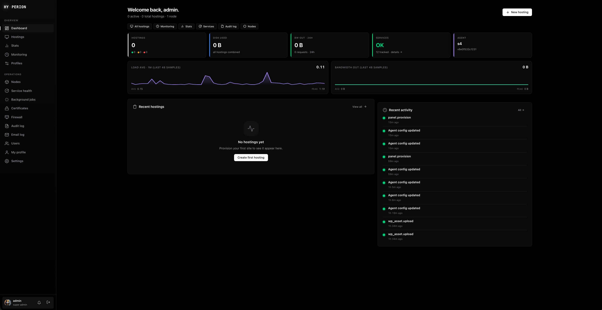
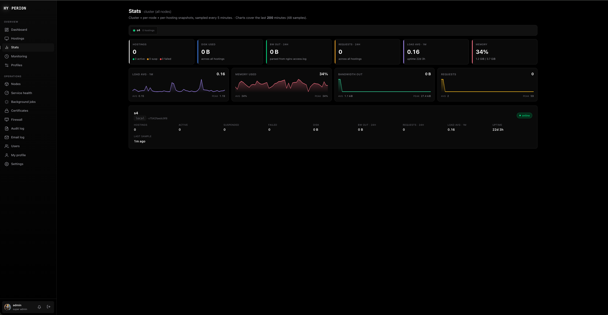

<div align="center">

# 🦅 Hyperion

**Self-hosted, multi-node hosting control panel written in Rust.**

One binary per server, one web UI on the master. It provisions
PHP / static / Node.js sites end-to-end — Linux user, nginx vhost,
FPM pool, database, TLS, WordPress — in one transaction that rolls
back cleanly if any step trips, so you never inherit a half-built
site at 2am. Runs a fleet of VPSes from one screen, drives it all
from a **scriptable HTTP API + CLI**, and **imports what you've
already got on HestiaCP or CloudPanel**.

[](https://www.rust-lang.org/)
[](#license)
[](#install)
[](#testing)
[](#remote-api)
[](#project-status)

[**Install**](#install) · [**Features**](#features) · [**Remote API**](#remote-api) ·
[**Migrate in**](#migrate-in-panel-import) · [**Multi-node**](#multi-node-cluster) ·
[**Architecture**](#architecture) · [**Status**](#project-status)

</div>

---

> [!WARNING]
> ### 🧪 Young project — not yet battle-tested in production
>
> Hyperion is a free-time project. It compiles, 700+ tests are green, and it's
> been driven end-to-end across throwaway VMs — and it has **never once seen real
> production traffic.** Schrödinger's hosting panel: probably fine, definitely
> unobserved. **Run it on boxes you'd be happy to `dd` into oblivion, keep
> backups, and don't point anything you can't afford to lose at it — yet.**
>
> 🙏 **Testers & reviewers wanted.** Kick the tyres and tell me what breaks —
> feedback on **functionality, security, or just design / UX** is worth its weight
> in `cargo build` minutes right now. Open an issue, however rough.

---

## Contents

- [Screenshots](#screenshots)
- [Why Hyperion?](#why-hyperion)
- [Install](#install)
  - [One-liner](#one-liner--fresh-debian-12-vps-as-root) · [Configurator & port pre-flight](#configurator--port-pre-flight) · [Worker nodes](#adding-a-worker-node-cluster-mode) · [Updates](#in-place-updates) · [Dev](#local-development-macos--dev-vps) · [Versioning](#versioning--releases)
- [Features](#features)
  - [Hosting](#hosting) · [Per-hosting controls](#per-hosting-controls) · [WordPress](#wordpress) · [File manager](#file-manager) · [Backups](#backups) · [Security](#security) · [Multi-node](#multi-node-cluster) · [Operator UI](#operator-ui) · [RBAC](#rbac--multi-tenancy)
- [Remote API](#remote-api) — scriptable HTTP + `hctl remote`
- [CLI](#cli) — local `hctl`
- [Migrate in (panel import)](#migrate-in-panel-import)
- [Multi-node cookbook](#multi-node-cookbook)
- [Architecture](#architecture)
- [Project layout](#project-layout)
- [Project status](#project-status)
- [Testing](#testing) · [Documentation](#documentation) · [Contributing](#contributing) · [License](#license)

---

## Screenshots

<table>
  <tr>
    <td width="50%" align="center">
      <a href="docs/screenshots/dashboard.png">
        
      </a>
      <br><sub><b>Dashboard</b> — KPI tiles, load + bandwidth sparklines, audit feed.</sub>
    </td>
    <td width="50%" align="center">
      <a href="docs/screenshots/stats.png">
        
      </a>
      <br><sub><b>Stats</b> — cluster + per-node, sampled every 5 min, 200-min charts.</sub>
    </td>
  </tr>
</table>

---

## Why Hyperion?

> The honest pitch: most open-source panels are PHP wrappers around shell
> templating. They work — right up until a domain with a funny character turns
> a config write into accidental `bash` improv, and you realise you've been
> trusting ~10 000 lines of string-concatenated shell running as root. Hyperion
> does the same job from a small, security-first Rust core where the worst a typo
> earns you is a compile error instead of a 2am page — and it scales across
> servers out of the box.

|                                           | HestiaCP / Vesta / aapanel | **Hyperion**                       |
| ----------------------------------------- | -------------------------- | ---------------------------------- |
| Memory-safe language                      | ❌ PHP + bash               | ✅ Rust, `#![forbid(unsafe_code)]`  |
| Multi-node cluster                        | ❌ single-node              | ✅ master + N workers, signed RPC   |
| Atomic provisioning (no half-creates)     | ⚠️ partial                  | ✅ LIFO rollback on every step      |
| Scriptable HTTP API (OpenAPI) + CLI       | ⚠️ partial / unofficial     | ✅ `/api/v1` + `hctl remote`        |
| Live progress for long operations         | ❌                          | ✅ HTMX-polled bar on every job     |
| Tamper-evident audit log                  | ❌                          | ✅ BLAKE3 hash chain                |
| TOTP 2FA + per-session revocation         | ⚠️ partial                  | ✅ in core                          |
| WP install + plugin manage + Redis cache  | ⚠️ via plugins              | ✅ first-class                      |
| Zero-config Let's Encrypt + auto-renewal  | ✅                          | ✅ HTTP-01 + DNS-01 wildcard        |
| Per-hosting disk quota (kernel-enforced)  | ✅                          | ✅                                  |
| Off-site backups (S3 + age encryption)    | ⚠️ FTP only                 | ✅ S3 + age (multi-target)          |
| One-click cross-node migration + clone    | ❌                          | ✅                                  |
| Import *from* HestiaCP / CloudPanel       | ❌                          | ✅ in-place or remote (SSH)         |

---

## Install

### One-liner — fresh Debian 12+ VPS, as root

```bash
curl -fsSL https://raw.githubusercontent.com/nechodom/hyperion/main/packaging/install/install-master.sh \
  | sudo bash
```

Yes, it's `curl | sudo bash` piping a script straight into root. Read it
first — I would.

In ~3–5 minutes the script runs a **port pre-flight** and a **configurator**
(below), then apt-installs the chosen packages + PHP 8.3, builds Hyperion from
source, lays down `/etc/hyperion/{agent,web}.toml`, installs systemd units,
starts both services, and prompts for an admin password.

```
============================================================
  ✓ Hyperion master installed
  ----------------------------------------
  Web UI:   https://<your-host>:8443
  CLI:      hctl info
============================================================
```

```bash
sudo usermod -aG hyperion-admin "$USER"   # log out / in, then visit the URL
```

### Configurator & port pre-flight

Hyperion drives **host** services (nginx, PHP-FPM, and optionally MariaDB /
PostgreSQL / vsftpd), so before touching anything the installer checks it can
actually run there — handy on a box that already runs docker or another stack.

**Port pre-flight** — for every port it needs (80, 443, panel, FTP, DB, node
RPC) it finds the holder (`ss` + `docker ps`) and, on a conflict, prints exactly
what holds it and offers to **[s]top it or [a]bort**. A port already owned by
the right service (a re-run) is not a conflict.

**Component + port picker** — `nginx` + `PHP-FPM` are always installed;
**MariaDB / PostgreSQL / vsftpd** are opt-out via an interactive `[Y/n]`; and
ports are adjustable. Whatever you skip is neither installed, started, nor
pre-flight-checked.

```bash
# Dry-run: check a candidate box WITHOUT installing anything
curl -fsSL <installer-url> | sudo HYPERION_PREFLIGHT_ONLY=1 bash

# Non-interactive: no local DBs (using one in docker), custom FTP + panel ports
curl -fsSL <installer-url> | sudo \
  HYPERION_WITH_POSTGRES=0 HYPERION_WITH_MARIADB=0 \
  HYPERION_FTP_PORT=2121 HYPERION_LISTEN=0.0.0.0:9000 bash
```

<details>
<summary>All installer env knobs</summary>

| Env | Default | Effect |
| --- | --- | --- |
| `HYPERION_ADMIN_USER` / `HYPERION_ADMIN_PASS` | `admin` / prompt | bootstrap admin |
| `HYPERION_LISTEN` | `0.0.0.0:8443` | panel bind addr:port |
| `HYPERION_ACME_EMAIL` | — | Let's Encrypt contact |
| `HYPERION_WITH_MARIADB` / `_POSTGRES` / `_VSFTPD` | `1` (install) | component on/off |
| `HYPERION_FTP_PORT` | `21` | vsftpd control port |
| `HYPERION_RPC_PORT` | `9443` | master→node RPC port *(node installer)* |
| `HYPERION_NONINTERACTIVE` | — | accept defaults, no prompts |
| `HYPERION_PREFLIGHT_ONLY` | — | run checks + exit, install nothing |
| `HYPERION_STOP_CONFLICTS` / `HYPERION_ALLOW_SHARED` | — | auto-stop port holders / ignore conflicts |
| `HYPERION_REF` · `HYPERION_INSTALL_DIR` · `HYPERION_GIT_URL` · `HYPERION_GIT_TOKEN` · `HYPERION_LOCAL_TARBALL` · `HYPERION_SKIP_CLONE` | — | source acquisition (branch/tag, private repo, offline) |

See [`docs/RUNBOOK.md`](docs/RUNBOOK.md) for private-repo and air-gapped installs.
</details>

### Adding a worker node (cluster mode)

Web UI → **Nodes** → fill label → **Generate invite** → copy the printed
`curl … | sudo bash --token=… --master=…` command and paste it on a fresh
Debian 12+ VPS (it runs the same pre-flight + configurator). The node enrolls
within ~30 s and shows up in the Nodes table; from then on you provision
hostings on it straight from the master UI.

### In-place updates

```bash
sudo /opt/hyperion/packaging/install/update.sh
# or, from the web UI: /install → row for the node → Update…
```

Stops services, fast-forwards `/opt/hyperion`, rebuilds, reinstalls binaries,
refreshes systemd units only if they changed, and tails `journalctl` on health
failure. While `hyperion-web` is briefly down mid-update, the panel vhost serves
a self-refreshing **"Hyperion is updating…"** page (HTTP 503), not a bare nginx
502, and returns automatically once the service is back.

### Local development (macOS / dev VPS)

```bash
git clone https://github.com/nechodom/hyperion
cd hyperion
cargo build --release --workspace   # → target/release/{hyperion-agent,hyperion-web,hctl}
```

See [`docs/RUNBOOK.md`](docs/RUNBOOK.md#local-development) for a minimal rootless
`agent.toml` + `web.toml`.

### Versioning & releases

Every binary stamps its own version at build time (`build.rs`), so `--version`
always tells you exactly what's running:

```bash
hyperion-agent --version
# hyperion-agent v0.8.3-2-gf718fd1 (f718fd1a…full 40-char SHA…)
```

The human part is `git describe` against the nearest `vX.Y.Z` tag. There's
nothing to bump by hand — cut a milestone with `git tag vX.Y.Z && git push
--tags` and CI builds a named GitHub release. A `rolling` release ships on every
push to `main` (what `update.sh` pulls); both contain byte-identical binaries
for the same commit.

---

## Features

### Hosting

- **One-click create** — Linux user, PHP-FPM pool, MariaDB / Postgres DB, nginx vhost, self-signed cert, all in one transaction. Failure at any step rolls back the rest — no orphan rows, no zombie users.
- **PHP 8.1 / 8.2 / 8.3 / 8.4** side by side via deb.sury.org. Static-only sites, and a reverse-proxy mode for Node.js / Python / Docker.
- **Suspend / resume** — 503 page, FPM stop, DB lock, user processes killed. Fully reversible.
- **Hosting profiles** — stamp the same limits + WP plugins + DB engine onto a hundred sites in one click.
- **Every slow action is a background job** — create, migration, clone, backup, restore, cert issue, WP install, staging push, panel import, and bulk actions all spawn a detached server-side job and redirect to a live HTMX-polled `/jobs/<id>` page. Close the tab and the work keeps running; an orphan reaper fails anything a restart interrupts.
- **Cross-node hosting migration** with version preflight, and **clone** to a new domain on the same or different node.
- **Expiration + grace** with scheduled notifications and auto-suspend.
- **Quota enforcement** — kernel-level disk quota via `setquota`, PHP `memory_limit` per FPM pool, monthly bandwidth alerts.
- **Let's Encrypt certs** — HTTP-01 one-click with automatic renewal, working through a Cloudflare/CDN proxy as-is. **DNS-01 wildcards** (`*.domain`) are available via guided manual TXT records, but cannot renew themselves — Hyperion holds no DNS credentials by design.

### Per-hosting controls

Operator knobs mapping straight to nginx / FPM / WordPress. Every save runs
`nginx -t` before commit; failures surface the verbatim daemon error.

- **HTTP basic auth** (bcrypt htpasswd + ACME bypass), **HSTS** presets + force-HTTPS, **custom nginx snippet** (validated, 32 KiB cap), **maintenance mode**, **per-hosting FastCGI page cache**.
- **WP debug toggle** + rotate `debug.log`, **per-hosting Redis object cache** (dedicated ACL user, written to `wp-config.php`), **per-hosting `php.ini` override** via `.user.ini` (no FPM restart).
- **Live log tail + search** (access/error, no SSH), **health score + notes / tags**, **vhost auto-heal** (missing cert → fresh self-signed bootstrap so `nginx -t` never breaks).

### WordPress

- **Plugin + theme manager** via `wp-cli` — list / install / activate / update / delete, bulk "update all", per-plugin auto-update toggle, upload a `.zip`.
- **Keyless "defender"** — outdated plugin/theme detection against the public WordPress.org version data (no API key, cached on the node), severity-sorted, with a one-click **minor/patch auto-update**. "Couldn't check" is never reported as "all clear".
- **Staging → push-to-prod** — one click spins up a `staging.<domain>` copy (files + DB, WP URLs rewritten); another pushes it back over production after a **pre-push safety backup** of prod first.

### File manager

- Browse / upload / download / delete / mkdir / rename under `htdocs/`, plus an **inline editor** for text files (no SCP round-trip).
- Symlinks refused at the adapter layer; path traversal refused after canonicalisation; 64 MB write cap; type-the-name delete confirmation.

### Backups

- **Local** — tar.gz of htdocs + `mysqldump` / `pg_dump` + JSON manifest on `/var/lib/hyperion/backups`.
- **Off-site S3 + age encryption** — multi-target (Wasabi / Backblaze B2 / Minio / AWS), per-target retention (daily / weekly / monthly), client-side age encryption (operator keeps the private key off the node). Legacy **FTP/FTPS/SFTP** push still supported.
- **Retention** (max age + minimum N per hosting, pruned hourly), **granular restore** (full / **DB-only** / **files-only**), **chunked download** from the browser, and **restore as a new domain** (mirrors PHP/DB/kind; WP URLs auto-rewritten).

### Security

- **`#![forbid(unsafe_code)]`** in every crate. **Argon2id** passwords, **Ed25519-signed session cookies** with a DB-backed revocation ledger.
- **TOTP 2FA** with backup codes — **enforced for admin+** roles, "remember this device 30 days" option.
- **Native brute-force protection (fail2ban)** — the agent scans each site's access log for `wp-login.php` / `xmlrpc.php` floods and auto-bans via an `nftables` set (auto-expiring, survives reboots); manual ban/unban per hosting.
- **WAF-lite + wp-admin IP allowlist** per hosting, **key-only chrooted SFTP** (gated by `sshd -t`), **per-IP rate limit** on login + 2FA verify.
- **CSP + HSTS + X-Frame-Options + Permissions-Policy + Referrer-Policy** on every response, **per-form CSRF tokens**, **tamper-evident audit log** (BLAKE3 hash chain + `Verify chain` button), **constant-time** secret compares.

### Multi-node cluster

- **Master + worker model.** Master holds the web UI, audit log, and node registry; workers run an agent the master drives over a **signed RPC channel** (Ed25519 envelope over self-signed HTTPS, port 9443, IP-based — no DNS dependency).
- **Per-page node switcher**, **hosting auto-placement** (scores load + memory + hosting count), **one-click migration / clone** across nodes with live progress + version preflight, **remote node update** (apt + Hyperion, log streams into the panel).
- **Test-node mode** (auto-subdomains, `blog_public=0`, prod refuses to land), **cluster-wide stats + monitoring**, **master-as-control-plane-only** toggle.

### Operator UI

- **axum + askama + HTMX**, no JS build step, single binary; themed confirm modals (type-the-domain for deletes); live service-install progress; a **`/jobs`** page for every long op (survives browser disconnect, reaper for orphans); role-aware navigation; dark + light themes.

### RBAC + multi-tenancy

Five roles: **super_admin** (god mode + user management), **admin** (sees
everything, no user management), **operator** (CRUD on assigned hostings),
**customer** (slim nav, only their own), **viewer** (read-only on granted
hostings). Per-hosting access grants for the bottom three, plus **custom roles**
built from a granular capability set.

---

## Remote API

A first-class, **scriptable HTTP API** at `/api/v1` — provision and operate the
whole cluster from CI, cron, or your own tooling, with a machine-readable
contract and an official CLI.

- **Auth** — a Bearer key (`Authorization: Bearer hyp_…`), minted in **Settings → API keys** (admin/`scope_all` accounts). The key carries a capability set clamped to its owner and **re-checked live** on every call (lock or demote the owner → the key loses power immediately).
- **Per-key hardening** — optional **IP allowlist** (CIDRs, matched against the real client IP behind nginx via `X-Forwarded-For`) and **rate limit** (req/min → `429 Retry-After`).
- **Contract** — `GET /api/v1/openapi.json` is a generated **OpenAPI 3** document (kept in lockstep with the routes); `GET /api/v1/docs` renders it in a self-hosted, no-CDN viewer. Generate a client in any language.
- **Conventions** — list endpoints paginate (`{items, next_cursor, total}` + `?limit&cursor&state&node&q`); slow mutations return **`202 {job_id}`** you poll at `/api/v1/jobs/:id`; errors are a JSON envelope with the right status (`400/401/403/404/409/429/502`).

<details>
<summary>Endpoint map</summary>

| Method | Path | Purpose |
| --- | --- | --- |
| GET | `/api/v1/me` | the key's identity + caps |
| GET | `/api/v1/hostings` | list (paginated + filtered) |
| GET | `/api/v1/hostings/:id` | detail |
| POST | `/api/v1/hostings` | create → `201` / `409` |
| PATCH | `/api/v1/hostings/:id/{limits,php,vhost,expiry,quota}` | config |
| POST | `/api/v1/hostings/:id/{suspend,resume}` | lifecycle |
| DELETE | `/api/v1/hostings/:id` | delete → `202 {job_id}` |
| POST | `/api/v1/hostings/:id/{backup,cert,wp/install,restore}` | ops → `202 {job_id}` |
| GET | `/api/v1/hostings/:id/backups` | list backups |
| POST | `/api/v1/certs/renew-all` | cluster cert renew → `202 {job_id}` |
| GET | `/api/v1/nodes` · `/api/v1/jobs/:id` | cluster nodes · job status |

All writes enforce the same per-hosting access checks as the UI.
</details>

### `hctl remote` — the CLI over the API

```bash
# one-time: save url + key to ~/.config/hyperion/remote.toml (0600)
hctl remote --url https://panel.example.com --key hyp_… login

hctl remote list --state active | jq '.items[].domain'
hctl remote create --domain new.example.com --php v8_3
hctl remote backup new.example.com --wait     # polls the job to completion
hctl remote suspend new.example.com
hctl remote openapi > openapi.json            # dump the contract
```

Every command prints the API's JSON verbatim (pipes into `jq`); a non-2xx status
exits non-zero. Connection resolves flags → `HYPERION_API_URL`/`HYPERION_API_KEY`
env → the config file. `--insecure` skips TLS verify for self-signed panels.

---

## CLI

`hctl` is also a thin client over the same Unix socket as the web UI — the
"ssh in and poke" path when the node is too broken for the web to help. (For the
HTTP API from *any* host, see [`hctl remote`](#hctl-remote--the-cli-over-the-api).)

```console
$ hctl info
agent: master.example.com version=v0.8.3-2-gf718fd1 schema=54 hostings=12

$ hctl hosting create example.com --php 8.3 --db mariadb
✓ created example_com (id=01K4Z…)
  root: /home/example_com/example.com/htdocs
  db:   lm_a8c_examplecz (user=lm_a8c_u, password=Hx9k…RnG2)

$ hctl hosting suspend example.com --reason="payment overdue"
✓ suspended

$ hctl audit --limit 3
   ID  TS               ACTOR    ACTION                 RESULT
   42  2026-06-08 14:42 agent    hosting.backup         ok
   41  2026-06-08 14:42 agent    hosting.suspend        ok
   40  2026-06-08 14:42 cli:root hosting.set_limits     ok
```

---

## Migrate in (panel import)

Move existing sites off another panel without a weekend of manual work. Wizard
at **`/import`** (admin) or `hctl hosting import-panel`.

- **Sources: HestiaCP and CloudPanel** — reads the source panel's own state directly (Hestia's `*.conf`, CloudPanel's SQLite), no scraping.
- **In-place or remote over SSH** — remote imports from another machine with a host + private key (used for that one run, `0600`, deleted after — never stored); files come across with `rsync`, DBs dumped over `ssh`.
- **Dry-run first** — a plan shows **created / skipped / conflict** before anything is touched; an existing domain is skipped, never overwritten.
- **Sites + databases, WordPress included** — `wp-config.php` auto-repointed at the new credentials. **Mail & DNS are reported, never migrated** (Hyperion runs neither). Runs as a background job.

---

## Multi-node cookbook

Recipes — all doable from the master web UI; `hctl` / the API work too.

- **Move a hosting to a worker** — `/hostings/<domain>` → **Transfer** → Move → pick target. Full backup on the source, worker restores it, source is **suspended** (not deleted) so you can verify. Live progress on `/jobs/<id>`.
- **Clone prod → staging on another node** — **Transfer** → Copy → `staging.example.com` + target node. Source keeps serving; the copy comes up with the same PHP / DB / files.
- **Update a worker** — `/install` → worker row → **Update…** → tick → **Start**; the job runs on the worker, log tails into the panel.
- **Operate on one worker** — every node-aware page has a "View on node:" dropdown.
- **Import an existing panel** — **Import** (sidebar) → source + mode → **Preview** → **Apply**.

---

## Architecture

Two layers per box:

- **`hyperion-agent`** runs as root, owns all system state — users, dirs, nginx vhosts, FPM pools, DBs, certs, FTP, cron, backups. Listens on a local Unix socket (`/run/hyperion.sock`, mode 0660, group `hyperion-admin`). On worker nodes also on `0.0.0.0:9443` for signed RPC from the master.
- **`hyperion-web`** (master only) — axum + askama + HTMX, runs unprivileged in the `hyperion-admin` group. Owns the audit log, web users, sessions ledger, node registry, Ed25519 master signing key, and the `/api/v1` Bearer edge.

```
        web browser (cookies)        API client (Bearer hyp_…)
                     │                          │
                     ▼                          ▼
         ┌───────────────────────────────────────────────────┐
         │  hyperion-web (master only)                       │
         │  axum + askama + HTMX  ·  /api/v1 (OpenAPI)        │
         │  └─ holds master-rpc.key (Ed25519 signer)         │
         └────┬───────────────────────┬──────────────────────┘
              │ local Unix socket     │ signed RPC over HTTPS
              │ /run/hyperion.sock    │ (port 9443, IP-based)
              ▼                       ▼
    ┌──────────────────┐     ┌──────────────────┐
    │ hyperion-agent   │     │ hyperion-agent   │
    │ (master)         │     │ (each worker)    │
    │  HostingService  │     │  HostingService  │
    │  State DB (SQLite)│    │  State DB (SQLite)│
    │  Adapters:       │     │  Adapters:       │
    │   fs/users nginx │     │   fs/users nginx │
    │   php mysql/pg   │     │   php mysql/pg   │
    │   acme wp ftp    │     │   acme wp ftp    │
    └──────────────────┘     └──────────────────┘
      also: web UI + API       loops: 60s heartbeat,
      audit chain, registry    scheduler/5min, cert
      master signer            renewal, retention, reaper
```

Every adapter takes pre-validated typed arguments and shells out only via
`Command::new(..).arg(..)` — never `format!()` into a shell, the one rule that
turns "oops, an unescaped quote in a domain name" from an RCE into a boring type
error. Wire protocol is `u32be length || JSON`; the RPC envelope is
Ed25519-signed Canonical-JSON over self-signed HTTPS (integrity by signature,
not TLS).

---

## Project layout

```
hyperion/
├── crates/
│   ├── hyperion-types/       # newtype IDs + DTOs (no I/O)
│   ├── hyperion-validate/    # Domain + SystemUserName parsers
│   ├── hyperion-rpc/         # trait + wire types + codec
│   ├── hyperion-rpc-server/  # Unix-socket + mTLS server
│   ├── hyperion-rpc-client/  # RPC client
│   ├── hyperion-state/       # SQLite + 54 migrations + audit chain + api_keys
│   ├── hyperion-adapters/    # system tool wrappers (nginx/php/db/acme/ftp/…)
│   ├── hyperion-core/        # orchestration + secrets + RealAdapter
│   ├── hyperion-import/      # HestiaCP / CloudPanel importers
│   └── hyperion-auth/        # argon2id + Ed25519 sessions + CSRF
├── bin/
│   ├── hyperion-agent/       # privileged daemon (+ background scheduler)
│   ├── hyperion-web/         # axum admin UI + /api/v1 (single binary)
│   ├── hyperion-export/      # static-musl exporter served by the import wizard
│   └── hctl/                 # CLI (local socket + `remote` HTTP)
├── packaging/install/        # install-master.sh · install-node.sh · update.sh
└── docs/
    ├── RUNBOOK.md
    └── superpowers/specs/    # design specs (incl. remote-API + HA)
```

---

## Project status

**Beta.** A lot is shipped and every line is unit-tested, but none has been
hardened by real production traffic yet — read the lists as *"implemented and
demo-tested in VMs"*, not *"proven at scale"*.

### Shipped — single node

| Capability | Surface |
| --- | --- |
| Hosting CRUD (PHP / static / reverse-proxy + DB + TLS) | UI · CLI · **API** · RPC |
| Multi-version PHP (8.1–8.4), MariaDB / PostgreSQL | UI · CLI · **API** · RPC |
| Suspend / resume, limits, kernel disk quotas | UI · CLI · **API** · RPC |
| Hosting profiles, clone, expiration + scheduler | UI · **API** · RPC |
| Local + off-site backups (S3 + age, legacy FTP/SFTP) | UI · CLI · **API** · RPC |
| Granular restore, chunked download, restore-as-new | UI · CLI · **API** · RPC |
| Let's Encrypt HTTP-01 + manual DNS-01 wildcard | UI · CLI · **API** · RPC |
| WordPress install + plugin/theme manage + admin reset | UI · **API** · RPC |
| Keyless WP defender (outdated scan + auto-update) | UI · CLI · RPC |
| WP staging → push-to-prod, Redis cache, `.user.ini` | UI · **API** · RPC |
| Per-hosting cron, log tail + search, monitor probes | UI · RPC |
| FTP (vsftpd chroot) + key-only chrooted SFTP | UI · CLI · RPC |
| WAF-lite + wp-admin allowlist, fail2ban (nftables) | UI · CLI · RPC |
| Audit log (BLAKE3 chain + verify), 2FA, session revoke | UI · CLI · RPC |
| Panel import — HestiaCP + CloudPanel (in-place + SSH) | UI · CLI · RPC |
| **Remote API — keys + OpenAPI 3 + IP allowlist + rate limit** | UI · **API** · CLI |
| Background jobs page with live progress bars | UI · CLI · **API** · RPC |

### Shipped — multi-node cluster

| Capability | Surface |
| --- | --- |
| Node enrollment (mint / list / revoke invite tokens) | UI · CLI · RPC |
| Master → worker signed RPC channel (Ed25519 envelope) | transport |
| Per-page node switcher, cluster stats aggregation | UI |
| Hosting auto-placement, migration + clone across nodes | UI · **API** · RPC |
| Remote node update (apt + hyperion) with live log tail | UI · RPC |
| Test-node mode + auto-subdomain, control-plane-only toggle | UI · agent.toml |
| Installer port pre-flight + component/port configurator | installer |

### Roadmap

- **HA control plane** — warm standby + continuous state replication ([design](docs/superpowers/specs/2026-06-30-ha-control-plane-design.md); an **S3-free** variant is possible — see the doc).
- **Per-tenant API keys** — tenant read-scoping so non-admin accounts can mint scoped keys.
- **Restic / borg backup targets**, **SSO / OIDC** login, **ModSecurity / OWASP CRS** over the built-in WAF-lite.

---

## Testing

```bash
cargo test --workspace                    # 700+ tests, green, runs in seconds
cargo fmt --all
cargo clippy --workspace --all-targets    # clean under -D warnings
```

Integration tests that want a real Debian (`useradd`, `mariadb-dump`,
`systemctl reload nginx`) are gated `#[ignore]`; run them on a node with
`cargo test --workspace -- --ignored`. `bin/hyperion-web/tests/web_e2e.rs`
drives the whole stack — login, CSRF, hosting create, **the `/api/v1` surface** —
against a real socket-backed agent with mocked adapters.

---

## Documentation

- **[`docs/RUNBOOK.md`](docs/RUNBOOK.md)** — manual production deploy (apt deps, configs, systemd, hardening, troubleshooting, backup, updates, removal).
- **[`docs/superpowers/specs/`](docs/superpowers/specs/)** — design specs, including the [remote API](docs/superpowers/specs/2026-07-02-scriptable-remote-api-design.md) and [HA control plane](docs/superpowers/specs/2026-06-30-ha-control-plane-design.md).

---

## Contributing

**Trying it out is the most valuable contribution right now.** Honest reports on
**functionality, security, or design / UX** are worth as much as code.
[Open an issue](https://github.com/nechodom/hyperion/issues), even a rough one.

When adding a new system effect: adapter (typed args, no shell interpolation) →
`AdapterPort` trait method (mockable) → orchestration in `HostingService` with a
LIFO rollback step → RPC variant + handler → CLI / UI / **API** surface → tests
at every layer. For multi-node features, never hit the local socket from a
per-hosting handler — always `dispatcher::dispatch_to_node`.

---

## License

[AGPL-3.0-only](LICENSE). Built as the open-source alternative to CloudPanel /
HestiaCP / Plesk — Rust instead of templated PHP, multi-node and API-driven from
day one, and a security model that doesn't rely on trusting shell-script
templating. If you use it commercially or want to fund a feature, get in touch.

---

<div align="center">

**[⬆ back to top](#-hyperion)**

Built with ☕ in Czechia by [@nechodom](https://github.com/nechodom), one `cargo build` at a time — contributions (and bug reports) welcome.

</div>
